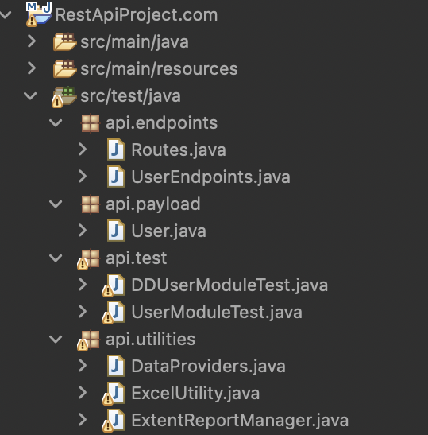
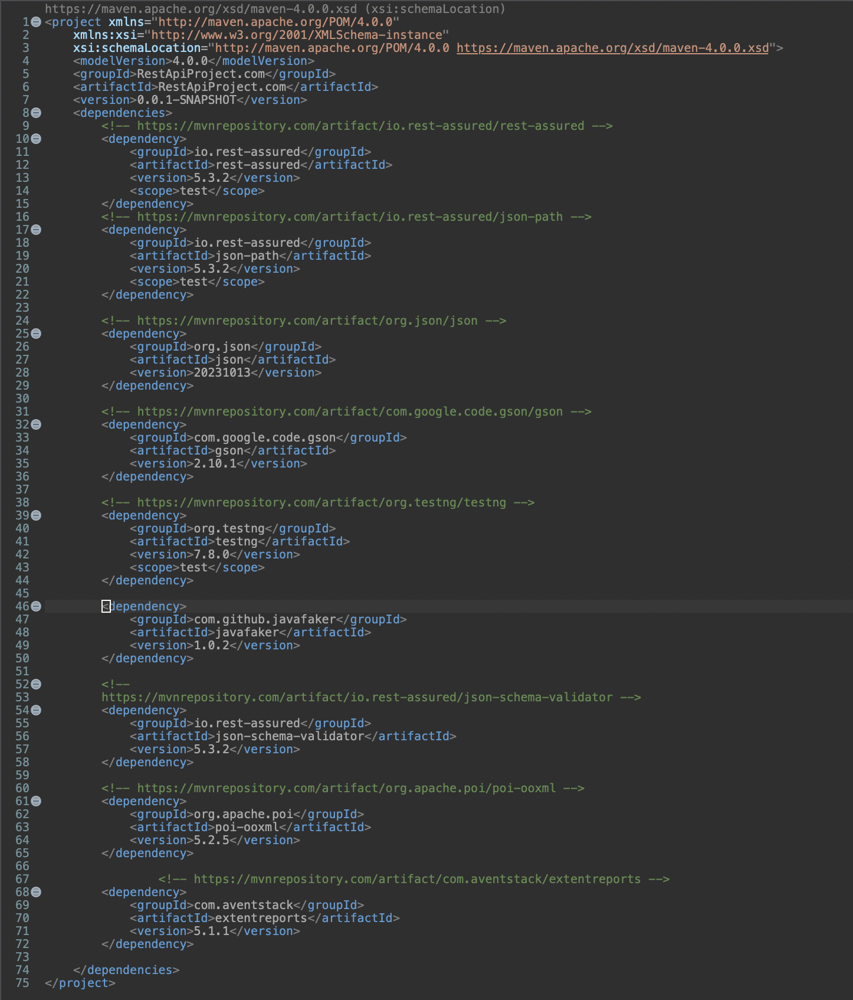
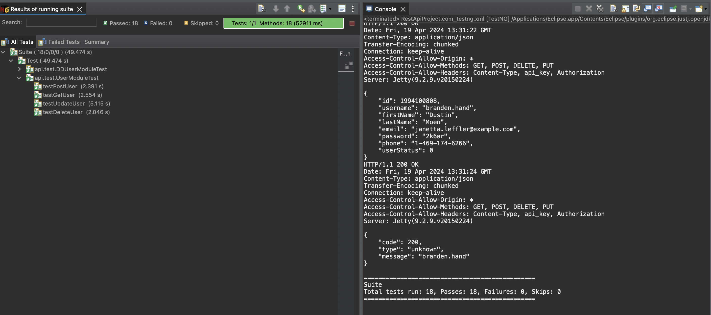
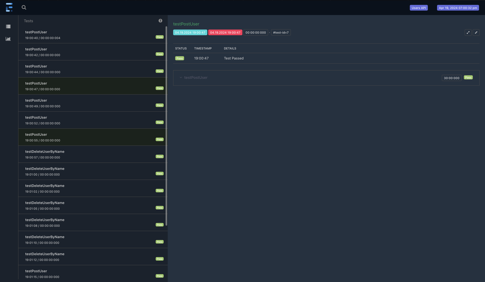

# RestAssured Api Automation Project:

<p align="Left"></p>

This project is meant for testing the Rest API using Rest assured library for performing CRUD operations. I have also added Data Driven testing using the same Rest assured library along with Extent reports.

## Motivation:
The reason behind creating this project is to automate the Swagger REST API Collections with CRUD operation automation for all the module of the API. The framework is designed in a way that further more modules/dependencies/libraries can added in the same framework eventually.

## Coding Style:
- I have used Java language with POM(Page Object Model) design pattern with Data-Driven Testing Framework.

## IDE/Language:
- IDE : Eclipse
- Language : Java

## Technology/Frameworks used:
- Rest assured - You should place rest-assured before the JUnit dependency declaration in your pom.xml / build.gradle in order to make sure that the correct version of Hamcrest is     used. REST Assured includes JsonPath and XmlPath as transitive dependencies
- Json-path - Standalone JsonPath (included if you depend on the rest-assured artifact). Makes it easy to parse JSON documents. 
- json - The files in this package implement JSON encoders/decoders in Java. It also includes the capability to convert between JSON and XML, HTTP headers, Cookies, and CDL.
- gson- Gson is a Java library that can be used to convert Java Objects into their JSON representation. It can also be used to convert a JSON string to an equivalent Java object.
- Test NG - TestNG is a testing framework inspired from JUnit and NUnit but introducing some new functionalities that make it more powerful and easier to use. It supports test configured by annotations, data-driven testing, parametric tests, etc.
- Javafaker - This library is a port of Ruby's stympy/faker gem (as well as Perl's Data::Faker library) that generates fake data. It's useful when you're developing a new project and need some pretty data for show case.
- json-schema-validator - Used to validate that a JSON response conforms to a Json Schema you can use the json-schema-validator module.
- Apache POI library- For the reading and writing the data in Excel sheet.
- Extent reports library - Used for the detailed reporting the test cases status with various information like pass, fail and skipped status of tests.
- Maven project - For the ease of handling the dependencies in one place.
- ITestListener - To listen the pass, fail and skipped test cases and add it to extent reports.

## Steps to create project and adding dependencies:
- Step 1 : Create a new project of type Maven in Eclipse IDE.
- Step 2 : Then add a testNG library by navigating to Java build path and adding testNG library. Then Apply and close.
- Step 3 : Next step is to add the important dependencies in the Pom.xml file(refer to the below dependencies screenshot).
- Step 4 : Since we are following POM design pattern we need to create four packages(refer to the below POM screenshot).
- Step 5 : Finally, add a class that implements iTestListener and has instance of Extent reports for adding test report in the provided directory.
- Step 6 : Create a new testng.xml file adding the test java classes to be executed under suite.
- Step 7 : Run the project a testNG suite.

## Dependencies screenshot:
<p align="Left"></p>

## POM file screenshot:
<p align="Left"></p>

## Test case Code Example:
- I have used POM design pattern with POJO classes for object creation that needs to be added in the payload of HTTP requests.
- I have also added the Excel data sheet file to perform Data Driven testing on the Rest API's in the api.test folder.
- Finally, based on the assertion the listener then report whether the test case as Pass/Fail/Skipped in extent report.

## Test Scenarios covered:
- CRUD operations using POJO class for payload.
- Data Driven testing using data from excel as payload for user creation and deletion operation.

## TestNG Suite success screenshot:
<p align="Left"></p>

## Extent report success screenshot:
<p align="Left"></p>

## People worked on this project
```Maginthan```
